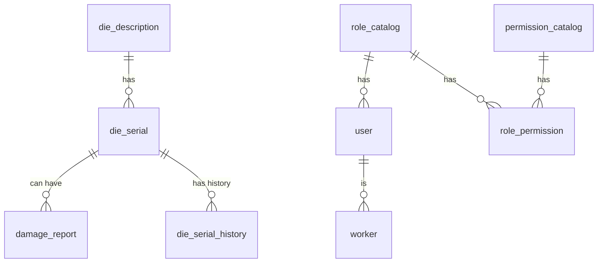

# Documentación de Base de Datos

## 1. Catálogos principales

Tablas base para atributos y valores estandarizados:

- **inch_catalog**: Diámetros de troqueles
- **part_catalog**: Cantidades y dimensiones de ranuras
- **description_catalog**: Formas y tipos de ranura
- **material_catalog**: Materias primas
- **position_catalog**: Posiciones o ubicaciones
- **line_catalog**: Líneas de producción
- **product_catalog**: Productos fabricados
- **status_catalog**: Estados posibles (New, Circulation, Scraped, etc.)
- **description_dr_catalog**: Tipos de daño reportado
- **explanation_catalog**: Motivos o explicaciones de daño/reparación

**Campos recomendados:**
- id INT AUTO_INCREMENT PRIMARY KEY
- name VARCHAR(100) NOT NULL (o description/material según el caso)
- is_active BOOLEAN DEFAULT TRUE

## 2. Troqueles y descripciones

- **die_description**: Relaciona inch, part y description para definir el tipo de troquel. Incluye mínimos en circulación y stock.
	- id, inch_id, part_id, description_id, die_description, min_en_circulacion, min_en_stock, is_active, timestamps
- **die_serial**: Registro individual de cada troquel con serial único, referencia a die_description y status.
	- id, serial_number, die_description_id, status_id, is_active, timestamps
	- (Opcional: inner, outer, proudness si se requiere trazabilidad física)

## 3. Reportes y movimientos

- **damage_report**: Reportes de daño, con referencias a serial, línea, producto, operador, supervisor, tipo de daño, explicación, muestra, nota, status y veredicto.
	- id, die_serial_id, line_id, product_id, operador_id, supervisor_id, description_dr_id, explanation_id, if_sample, nota, status_id, veredicto, timestamps
- **die_serial_history**: Historial de movimientos y cambios de estado de cada serial, con medidas y observaciones.
	- id, die_serial_id, status_id, fecha, inner_to_grind, outer_to_grind, note, proudness, inner_grinding, outer_grinding, inner_land_thickness, outer_land_thickness, damage_report_id, observed_damage_id, performed_by, product_id, line_id, timestamps


## 4. Usuarios, roles y permisos

### Estructura simple y escalable

- **role**: Tabla de roles principales (admin, gerente, setup_sr, setup, produccion). El admin puede crear, editar y eliminar roles desde la interfaz.
		```sql
		CREATE TABLE role (
			id INT AUTO_INCREMENT PRIMARY KEY,
			name VARCHAR(50) NOT NULL UNIQUE
		);
		```

- **user**: Usuarios del sistema, cada uno con un solo rol asignado. El admin puede asignar cualquier rol existente a un usuario.
		```sql
		CREATE TABLE user (
			id INT AUTO_INCREMENT PRIMARY KEY,
			username VARCHAR(50) NOT NULL UNIQUE,
			password VARCHAR(255) NOT NULL,
			role_id INT NOT NULL,
			FOREIGN KEY (role_id) REFERENCES role(id)
		);
		```

- **worker**: Personal técnico y operadores, con referencia a posición y usuario.
		```sql
		CREATE TABLE worker (
			id INT AUTO_INCREMENT PRIMARY KEY,
			name VARCHAR(100) NOT NULL,
			position_id INT,
			user_id INT,
			is_active BOOLEAN DEFAULT TRUE,
			fecha_creacion DATETIME DEFAULT CURRENT_TIMESTAMP,
			fecha_modificacion DATETIME DEFAULT CURRENT_TIMESTAMP ON UPDATE CURRENT_TIMESTAMP,
			FOREIGN KEY (position_id) REFERENCES position_catalog(id),
			FOREIGN KEY (user_id) REFERENCES user(id)
		);
		```

### Permisos y escalabilidad

- Los permisos de cada rol se definen en el backend (middleware), permitiendo cambios rápidos y flexibles sin modificar la base de datos.
- Si en el futuro necesitas permisos más granulares, puedes agregar una tabla `permission` y una relación `role_permission` sin romper la estructura actual.

**Ventajas:**
- El admin puede crear y asignar roles desde la interfaz.
- El sistema es fácil de mantener y escalar.
- Los permisos se gestionan en el backend, facilitando la evolución del sistema.

## 5. Relaciones y claves foráneas

- Todas las tablas principales deben tener claves foráneas bien definidas y ON DELETE/UPDATE RESTRICT o CASCADE según la lógica de negocio.
- Unifica nombres de campos para facilitar el desarrollo (por ejemplo, usa `name` o `description` en vez de `valor` o `nombre`).

## 6. Auditoría y buenas prácticas

- Agrega campos de auditoría si es necesario (created_by, updated_by).
- Usa DECIMAL para medidas físicas y TEXT para notas largas.
- Mantén el campo `is_active` en todas las tablas para desactivación lógica.

## 7. Ejemplo de relaciones clave



## 8. Ejemplo de tabla unificada (catálogo)

```sql
CREATE TABLE IF NOT EXISTS catalog_example (
	id INT AUTO_INCREMENT PRIMARY KEY,
	name VARCHAR(100) NOT NULL,
	is_active BOOLEAN DEFAULT TRUE
);
```


## 9. Notas y recomendaciones

- Revisa y ajusta los tipos de datos según el volumen y uso esperado.
- Documenta cada tabla y relación en este archivo antes de modificar los scripts SQL.
- Haz revisiones periódicas con el equipo antes de migrar o modificar la base de datos.

## 10. Seeds (poblado inicial de datos)

Los seeds son scripts que permiten poblar la base de datos con datos iniciales y de prueba, facilitando el desarrollo y las pruebas del sistema.

### Seeds disponibles

- `seed_inch_catalog.js`
- `seed_part_catalog.js`
- `seed_description_catalog.js`
- `seed_line_catalog.js`
- `seed_position_catalog.js`
- `seed_status_catalog.js`
- `seed_description_dr_catalog.js`
- `seed_explanation_catalog.js`
- `run_all_seeds.js` (ejecuta todos los anteriores)

### Ejecución de seeds

Para poblar la base de datos, ejecuta el script principal:
```bash
node backend/seeds/run_all_seeds.js
```

### Recomendaciones

- Verifica que los seeds incluyan validaciones para evitar duplicados si se ejecutan varias veces.
- Actualiza los seeds cuando cambien los catálogos o se agreguen nuevos valores.
- Documenta los datos incluidos en cada seed para facilitar mantenimiento y pruebas.


## 11. Sugerencias de mejora y aclaraciones

- Revisa la consistencia de nombres de campos y tablas en todos los archivos y scripts.
- Asegúrate de que las relaciones clave estén documentadas y sean claras para nuevos desarrolladores.
- Considera agregar ejemplos de datos incluidos en cada seed para referencia rápida.
- Si requieres trazabilidad avanzada, agrega y documenta campos como `created_by`, `updated_by` en las tablas principales.
- Documenta una guía básica para respaldos y migración de datos históricos (por ejemplo, desde Excel).
- Agrega ejemplos de pruebas unitarias y validaciones en backend.md y frontend.md.
- Documenta el uso de bcrypt para contraseñas y JWT para autenticación en backend.md.
- Recuerda actualizar todos los archivos de documentación cada vez que se agregue una nueva función, tabla o flujo importante.
